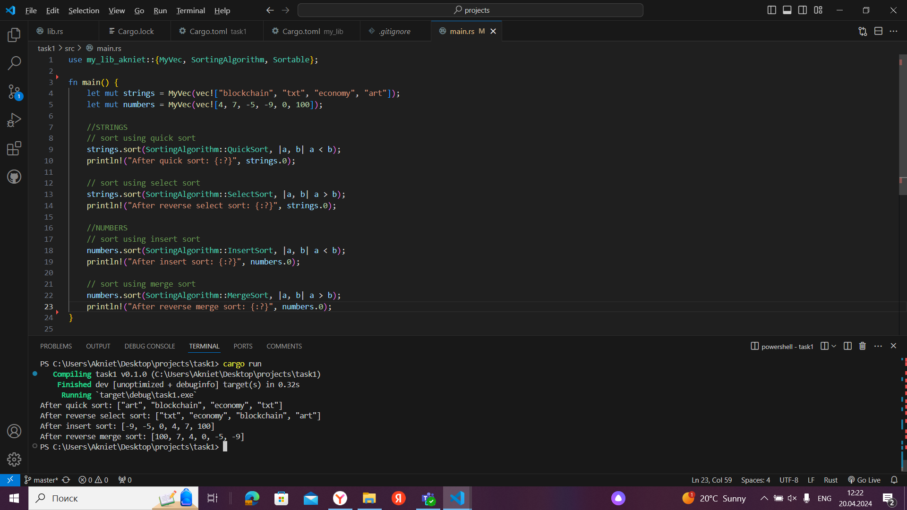
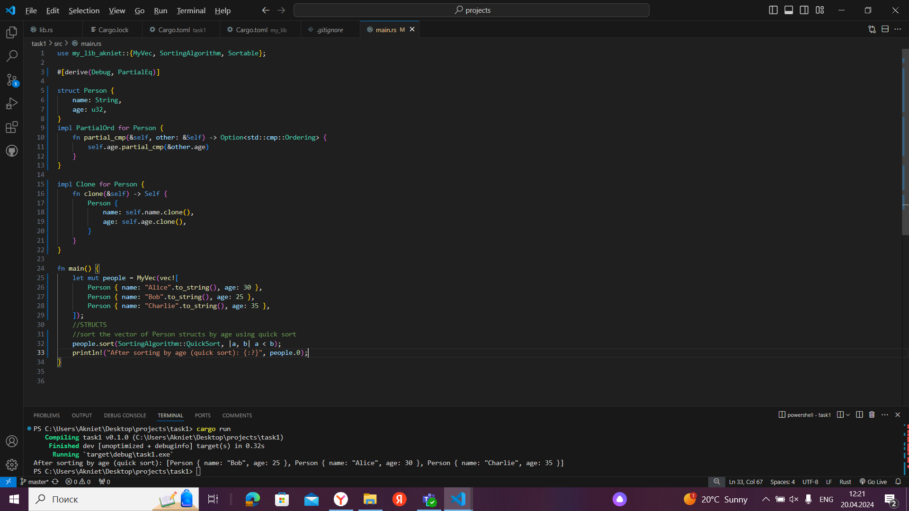

## Sorting Library - my_lib_akniet
This Rust library provides a variety of sorting functions for different data types using popular algorithms like quick sort, select sort, insert sort, and merge sort. These functions are flexible, allowing you to sort lists of objects and customize the comparison operator.

## Usage

To use this library in Rust project, add the following dependency to your Cargo.toml file:
```
[dependencies]
my_lib_akniet = "0.1.0"
```
Once added, import the sorting functions into your Rust code and utilize them as necessary. Below is an example demonstrating how to use the sorting algorithms:
```
use my_lib_akniet::{MyVec, SortingAlgorithm, Sortable};

fn main() {
    let mut strings = MyVec(vec!["blockchain", "txt", "economy", "art"]);
    let mut numbers = MyVec(vec![4, 7, -5, -9, 0, 100]);

    //STRINGS
    // sort using quick sort
    strings.sort(SortingAlgorithm::QuickSort, |a, b| a < b);
    println!("After quick sort: {:?}", strings.0);

    // sort using select sort
    strings.sort(SortingAlgorithm::SelectSort, |a, b| a > b);
    println!("After reverse select sort: {:?}", strings.0);

    //NUMBERS
    // sort using insert sort
    numbers.sort(SortingAlgorithm::InsertSort, |a, b| a < b);
    println!("After insert sort: {:?}", numbers.0);

    // sort using merge sort
    numbers.sort(SortingAlgorithm::MergeSort, |a, b| a > b);
    println!("After reverse merge sort: {:?}", numbers.0);
}
```

### License
This library is distributed under the terms of the Apache License, Version 2.0. Refer to the LICENSE file for more details.

For additional information and detailed usage examples, consult the documentation.

### Demo Screenshots



### Usage Examples
Sorting functions can be applied:

Sorting a list of integers(screenshot1).
Sorting a list of strings(screenshot1).
Sorting a list of custom structs based on a specific field(screenshot2).
